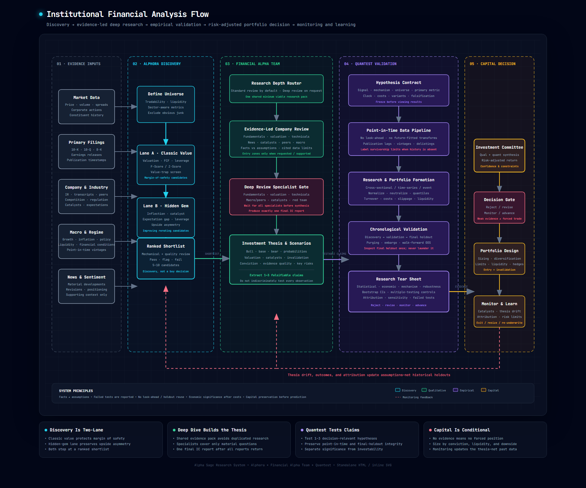

# Alpha Sage Research Stack

> **From evidence to conviction:** an institutional investment-research workflow connecting macro regime analysis, equity discovery, fundamental due diligence, point-in-time empirical validation, and disciplined capital decisions.

Alpha Sage is a modular financial-analysis system built around four complementary Hermes Agent skills. Each repository owns a distinct stage of the investment process so screening, qualitative research, quantitative validation, and portfolio judgment are not collapsed into one opaque score.

## Architecture

[](assets/financial-analysis-flow.html)

**[Open the interactive architecture diagram](assets/financial-analysis-flow.html)**

The diagram illustrates the complete process from evidence inputs through monitoring and feedback. Click the image or the link above to open the standalone interactive HTML version.

## Component Repositories

| Stage | Repository | Role | Access |
|---:|---|---|---|
| 1 | **[Macro Regime Analyst](https://github.com/Koktongkt/macro-regime-analyst)** | Assesses growth, inflation, liquidity, financial conditions, and policy; translates the regime into conditional cross-asset implications. | Public |
| 2 | **[Alphora](https://github.com/Koktongkt/alphora-skill)** | Screens US equities through separate classic-value and hidden-gem/upside-asymmetry lanes, then produces a quality-reviewed shortlist. | Public |
| 3 | **[Financial Alpha Team](https://github.com/Koktongkt/financial-alpha-team)** | Performs evidence-led company research, valuation, technical and catalyst analysis, red-team review, scenario construction, and investment-committee synthesis. | Private — owner-authorized access required |
| 4 | **[Quantest](https://github.com/Koktongkt/quantest)** | Tests falsifiable investment claims using point-in-time data, chronological holdouts, realistic implementation costs, robustness analysis, and multiple-testing controls. | Public |

> The Alphora project is displayed by its skill name, while its current GitHub repository slug is `alphora-skill`.

## End-to-End Research Flow

```text
Market, filing, company, macro, and news evidence
                         ↓
                  Macro regime context
                         ↓
          Alphora two-lane equity discovery
             ├─ Classic value candidates
             └─ Hidden-gem / rerating candidates
                         ↓
                  Ranked stock shortlist
                         ↓
        Financial Alpha Team company research
             ├─ Fundamentals and valuation
             ├─ Technicals, catalysts, and peers
             ├─ Macro and industry transmission
             └─ Bear case / red-team review
                         ↓
          Bull, base, and bear investment thesis
                         ↓
       Extract 1–3 decision-relevant testable claims
                         ↓
             Quantest empirical validation
             ├─ Point-in-time alignment
             ├─ Discovery and validation
             ├─ Final untouched holdout
             ├─ Costs, turnover, and liquidity
             └─ Robustness and failed tests
                         ↓
      Reject / revise / monitor / advance with constraints
                         ↓
        Portfolio sizing, risk limits, and monitoring
```

## What Each Layer Decides

### 1. Macro Regime Analyst — What environment are we operating in?

Macro analysis establishes the context rather than dictating a trade. It separates the fundamental economic regime from the market-pricing regime and assesses:

- Growth level, momentum, and breadth
- Inflation level, direction, and persistence
- Liquidity and financial conditions
- Monetary and fiscal policy
- Financial stress and cross-asset transmission
- Base, upside, and downside macro scenarios

Its output becomes an overlay for sector, factor, valuation, and risk assumptions.

### 2. Alphora — Which companies deserve deeper work?

Alphora is the discovery layer, not the final investment decision. It runs two complementary lanes:

- **Classic value:** valuation, free cash flow, leverage, financial quality, and value-trap avoidance.
- **Hidden gem / upside asymmetry:** fundamental inflection, catalyst clarity, expectation gaps, operating leverage, balance-sheet runway, and rerating potential.

Both lanes apply sector-aware metrics and business-quality review before producing a ranked shortlist.

### 3. Financial Alpha Team — Is there a defensible company thesis?

The Financial Alpha Team turns a candidate into an evidence-based investment thesis. Depending on requested depth, it evaluates:

- Business fundamentals and accounting quality
- Competitive position and industry structure
- Valuation and scenario-implied returns
- Technical setup and market expectations
- Catalysts, news, peers, and macro sensitivities
- Management execution and capital allocation
- Bear-case evidence and thesis invalidation
- Bull, base, and bear scenarios

A deep review waits for all required specialists and produces exactly one integrated Investment Committee report.

### 4. Quantest — Does the measurable claim survive empirical scrutiny?

Quantest tests the one to three most decision-relevant falsifiable claims from the thesis. It controls for:

- Look-ahead and survivorship bias
- Financial-statement publication dates and data vintages
- Discovery, validation, and final holdout separation
- Overlapping labels, purging, and embargo
- Train-only preprocessing and model fitting
- Signal normalization and neutralization
- Quantile formation and unintended exposures
- Turnover, spread, slippage, liquidity, capacity, and borrow
- Period, sector, universe, and parameter sensitivity
- Bootstrap uncertainty and multiple testing

It reports statistical, economic, mechanism, and robustness evidence separately and treats failed tests as valid research outcomes.

## Decision Framework

The stack does not force every researched company into a position. The terminal decision is one of four states:

| Decision | Meaning |
|---|---|
| **Reject** | The thesis, evidence quality, valuation, empirical result, or downside profile is inadequate. |
| **Revise and retest** | The idea may remain plausible, but the mechanism, data, assumptions, or specification needs correction. |
| **Monitor / paper trade** | Evidence is promising but insufficient, the catalyst is premature, or live behavior must be observed. |
| **Advance with constraints** | The thesis is supported strongly enough to consider capital allocation subject to sizing, liquidity, and invalidation rules. |

## Research Principles

1. **Capital preservation before prediction.** Attractive upside does not compensate for ignored ruin, dilution, liquidity, or balance-sheet risk.
2. **Facts, assumptions, and opinions remain separate.** Current factual claims should be sourced and dated.
3. **Screening is not valuation, and valuation is not validation.** Each layer has a distinct job.
4. **Macro is a conditional overlay, not a deterministic market call.**
5. **Only falsifiable claims enter empirical testing.** Do not backtest every narrative observation.
6. **No look-ahead, holdout reuse, or hidden failed tests.**
7. **Economic significance is measured after implementation costs.**
8. **Disconfirming evidence is mandatory.**
9. **Confidence reflects data quality, breadth, and stability.**
10. **Monitoring updates the live thesis without rewriting historical holdouts.**

## Suggested Usage

### Full investment workflow

1. Use **Macro Regime Analyst** to establish the economic and market-pricing backdrop.
2. Run **Alphora** to produce a shortlist from the desired universe and lane.
3. Apply the **Financial Alpha Team** deep-review workflow to high-priority candidates.
4. Extract the thesis's one to three most important measurable claims.
5. Use **Quantest** to validate those claims with a frozen point-in-time research design.
6. Combine qualitative and quantitative evidence in an Investment Committee decision.
7. If advanced, define position size, entry conditions, risk limits, thesis invalidation, and monitoring triggers.

### Lighter workflow

Not every stock requires all four layers. A normal company review can stop after a standard Financial Alpha Team assessment when:

- Capital at risk is small.
- The question is primarily qualitative.
- Historical point-in-time data is unavailable.
- The event is unique or binary and has too few comparable observations.
- A full empirical study would add complexity without improving the decision.

## Repository Contents

```text
alpha-sage-research-stack/
├── README.md
└── assets/
    ├── financial-analysis-flow.html
    └── financial-analysis-flow.png
```

- `README.md` provides the system overview and component links.
- `assets/financial-analysis-flow.png` is the rendered architecture preview.
- `assets/financial-analysis-flow.html` is the standalone interactive SVG diagram.

## Scope and Limitations

This repository is an architectural overview and navigation hub. The operating instructions, detailed methodologies, templates, and verification checklists live in the individual component repositories.

The system supports investment research and decision-making; it does not guarantee future performance and is not individualized financial, tax, or legal advice.
